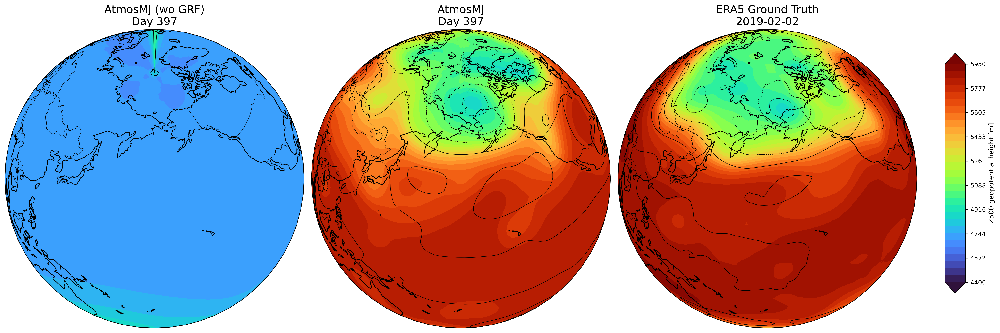
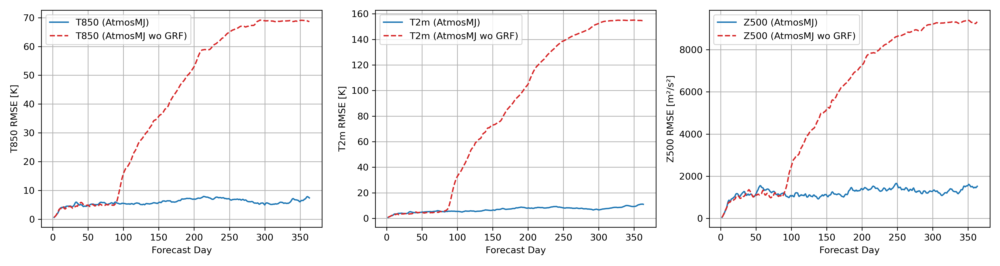
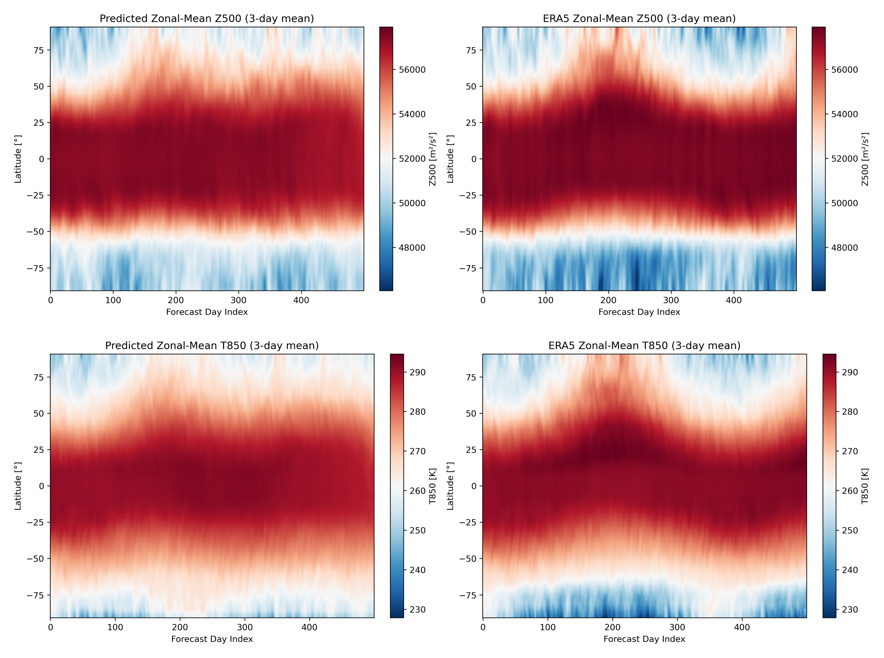

# 🌍 AtmosMJ

**[arXiv:2506.09733](https://arxiv.org/abs/2506.09733)**  
_Stable long-range weather forecasts on the lat-lon grid without spherical harmonics._

---

## ✨ Overview

**AtmosMJ** is a lightweight deep learning model for global weather forecasting that achieves:

- 🔁 **500-day stable autoregressive forecasts**  
- 🌀 A novel **Gated Residual Fusion (GRF)** module to prevent error accumulation  
- 📉 Competitive 10-day forecast accuracy  
- ⚡ Only **5.7 V100-days** of training time  
- 🗺️ Operates directly on standard **latitude-longitude grids** with no spectral transforms

## 🖼️ Simulation Example

  

*Figure: 500 hPa geopotential height (Z500) on Day 397 of simulation. AtmosMJ preserves realistic structures like the Aleutian Low and polar vortex.*

---

## 📉 GRF vs. No-GRF: RMSE Comparison

  

*Figure: RMSE over time for T850, T2m, and Z500 with (blue) and without (red) the GRF mechanism. GRF enables stable long-range forecasts.*

---

## 🌡️ Seasonal Evolution (Zonal Mean)

  

*Figure: 3-day running mean of zonal-mean Z500 (top) and T850 (bottom) over 500 days. AtmosMJ captures the seasonal progression and meridional gradients.*
